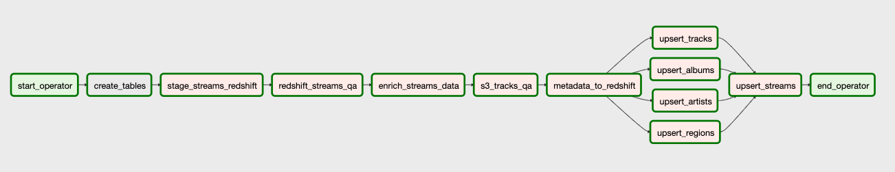

# Capstone

The goal of this project/pipeline is to collect and organize Spotify top streaming data from 2017 and provide additional metadata about these popular songs. The final resulting star schema built in Redshift will allow Analysts to identify trends about the artist, tracks, albums and regions without accessing the underlying data sources.

## Data Details
* This script gathers the 200 daily most streamed songs in 53 countries for the period between 2017-01-01 and 2018-01-09 from [Kaggle](https://www.kaggle.com/edumucelli/spotifys-worldwide-daily-song-ranking/data)
    * This dataset contains the daily ranking of the 200 most listened songs in 53 countries from 2017 and 2018 by Spotify users. It contains more than 2 million rows, which comprises 6629 artists, 18598 songs for a total count of one hundred five billion streams count.
* This streaming data is enriched with data from the [Spotify API](https://developer.spotify.com/documentation/web-api/quick-start/)
    * The API is interacted with using the [Spotipy Library](https://spotipy.readthedocs.io/en/2.13.0/#)

## Airflow

The script is ran using DAGs (Directed Acyclic Graphs) which is executed on Apache Airflow (more detials on setup foound in "Getting Started and Running Script" section below). I used Airflow to orchestrate the ETL process and maintain their correct frequency along with a PostgreSQL database. Along with managing/maintaing the frequency and ordering of the tasks, Airflow makes backfilling the years plus data easy. As soon as more streaming data is available and closer to real time, I shouldnt have to make any large fundamental changes to the script thanks to Airflow.

## Project Steps

The project steps can be followed by referencing the DAG and the associated tasks. (`start_operator` and `end_operator` are DummyOperators and do not perform tasks). 

1. __Create_Tables__
    * The first step is to create the staging tables (if they dont already exist) as well as all the tables that will make up the star schema in the redshift cluster.

2. __Stage_Streams_Redshift__
    * Populate the `streams_staging` table using `COPY` commands from s3 to Redshift

3. __Redshift_Streams_QA__
    * Data Quality Check
    * Ensure all the streaming data has been copied for the day by checking that all 53 countries are found in `streams_staging` table

4. __Enrich_Streams_Data__
    * Gather metadata from Spotify API about tracks found in `streams_staging` for the day
    * Store additional tracks metadata in S3

5. __S3_Tracks_QA__
    * Data Quality Check
    * Perform a unit test to ensure that tracks metadata CSV for the day has been successfully added to s3

6. __Metadata_to_Redshift__
    * Update `tracks_metadata` with additional tracks metadata using `COPY` command from s3 to Redshift

7. __Upsert Tables__
    * Upsert into `tracks`, `albums`, `artists` and `regions`
    * Now that all the necessary data is in Redshift, lets update all the dimension tables with any new information

8. __Upsert Streams__
    * Finally lets update the fact table in the schema with streaming data for the day
    * Create `id` fields to link to dimension tables for further analysis

## Final Data Model
This data model was selected because the `streams` (fact table) includes all the information needed to analyze the most popular songs in each region but if you would like additional details you can always join with the dimension needed but none of the dimensions you do not need. For example, if an analyst wants to specifically to analyze albums information they could without pulling in any data that is not pertinent.

Additionally as the data set continues to grow there will remain clear and logical differences between the tables and it is clear where specific data points should live.  

## Data Dictionary
__Streams__
| Column Name      | Definition                                      |
|------------------|-------------------------------------------------|
| event_stamp_date | date of song play                               |
| position         | popularity ranking on respective day and region |
| track_id         | unique track identifier                         |
| artist_id        | unique artist identifier                        |
| album_id         | unique album identifier                         |
| region_id        | unique region identifier                        |
| stream_count     | total number of song streams                    |

__tracks__
| Column Name | Definition                     |
|-------------|--------------------------------|
| track_id    | unique track identifier        |
| track_url   | spotify URL of song            |
| track_name  | Name of song                   |
| duration    | length of song in milliseconds |
| popularity  | Spotify's popularity scale     |
| explicit    | does song contain profanity    |

__artists__
| Column Name | Definition                     |
|-------------|--------------------------------|
| artist_id   | unique artist identifier       |
| artist_name | name of artist                 |

__albums__
| Column Name | Definition                     |
|-------------|--------------------------------|
| album_id    | unique album identifier        |
| album_name  | name of album                  |
| album_type  | type of album (album/complilation/single) |
| release_date  | date of album release        |

__regions__
| Column Name | Definition                     |
|-------------|--------------------------------|
| region_id   | unique region identifier       |
| region_name | region of song stream          |

## Addressing Other Scenarios
* __The data was increased by 100x__
    * Possibly migrate the job over to utilize a distributed system for data processing such as Pyspark on an EMR cluster
    * But if I ultimately didnt use PySpark I think I would need to increase my Redshift cluster resources to handle this increase in size
        * Run time would dramatically increase though
* __The pipelines would be run on a daily basis by 7 am every day__
    * I would simply change the DAG arguements to utilize a cron schedule vs `@daily`
    * I would also need to get Airflow running on a remote EC2 instance vs keeping my computer on all the time
* __The database needed to be accessed by 100+ people__
    * Again would need to increase Redshift cluster resources to account for the increase
    * Lock down tables with additional permissions to prevent incorrect data manipulation

## Getting Started and Running Script
1. Create an app on [Spotify Developers](https://developers.spotify.com/) to retreive your ID and SECRET
2. Download Spotipy, a lightweight Python library for Spotify Web API.
    * `pip install spotipy`
    * `pip freeze | grep spotipy > requirements.txt`
3. Run docker container
    * https://towardsdatascience.com/getting-started-with-airflow-using-docker-cd8b44dbff98
    * https://stackoverflow.com/questions/56904783/how-to-install-a-python-library-to-a-pulled-docker-image
    * `docker build -t capstone_airflow .`
    * `docker run -d --rm -p 8080:8080 -v /Users/adeniyiharrison/Documents/github/udacity-data-eng/capstone/dag:/usr/local/airflow/dags capstone_airflow webserver`
4. Set up Redshift cluster
5. Set up variables and connections on Airflow UI
    * "aws_key", "aws_secret", "spotify_client_id", "spotify_client_secret"
    * create "redshift" Postgres connection
6. Set backfill period in [DAG Arguements](https://github.com/aaharrison/udacity-data-eng/blob/1ea926dcba664fff65026541814eb5a2263ef550/capstone/dag/app.py#L319)
7. Navigate to [Airflow UI](http://localhost:8080/admin/) to track progress of backfill

