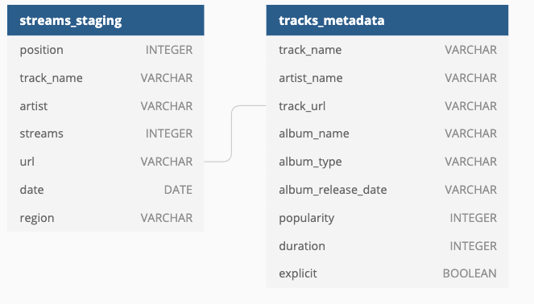
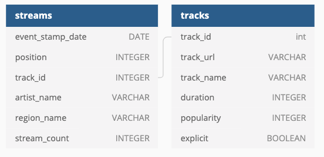
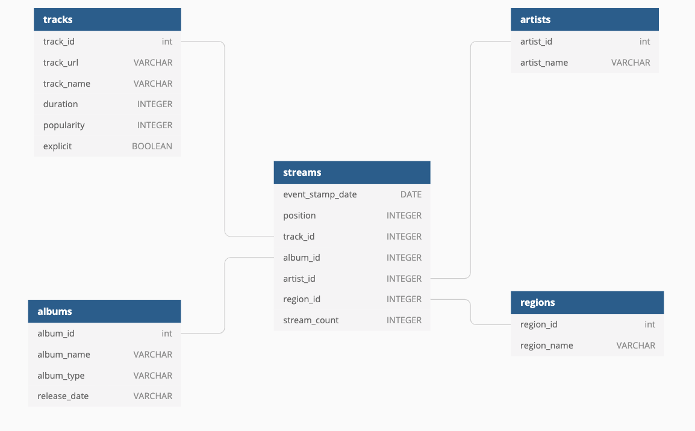

# Capstone

## Project Scope
* This script gathers the 200 daily most streamed songs in 53 countries for the period between 2017-01-01 and 2018-01-09 from [Kaggle](https://www.kaggle.com/edumucelli/spotifys-worldwide-daily-song-ranking/data)
    * This dataset contains the daily ranking of the 200 most listened songs in 53 countries from 2017 and 2018 by Spotify users. It contains more than 2 million rows, which comprises 6629 artists, 18598 songs for a total count of one hundred five billion streams count.
    * Placed in [personal S3 Bucket](https://s3.console.aws.amazon.com/s3/buckets/adeniyi-capstone-project/?region=us-west-1&tab=overview)
    * The script will migrate this data over to a Redshift staging table
* Via airflow the script incrementaily moves through this day by day and seaches the Spotify API to enrich the songs with additional track metadata
    * This track metadata is then stored in [S3](https://s3.console.aws.amazon.com/s3/buckets/adeniyi-capstone-project/track_metadata/?region=us-west-1&tab=overview)
    * The metadata is finally copied over to a Redshift staging table
* With this data the following staging tables are made

* Additional processing is performed to create the following tables

* If I were to continue with the same process as I did for the tracks table for the other dimensions I would end up with a true star schema

## Data Dictionary
__Streams__
| Column Name      | Definition                                      |
|------------------|-------------------------------------------------|
| event_stamp_date | date of song play                               |
| position         | popularity ranking on respective day and region |
| track_id         | track identifier (foreign key to tracks table)  |
| artist_name      | name of artist                                  |
| region_name      | region of song ranking                          |
| stream_count     | total number of song plays                      |

__tracks__
| Column Name | Definition                     |
|-------------|--------------------------------|
| track_id    | track identifier               |
| track_url   | spotify URL of song            |
| track_name  | Name of song                   |
| duration    | length of song in milliseconds |
| popularity  | Spotify's popularity scale     |
| explicit    | does song contain profanity    |

## Addressing Other Scenarios
* __The data was increased by 100x__
    * Possibly migrate the job over to utilize a distributed system for data processing such as Pyspark on an EMR cluster
    * But if I ultimately didnt use PySpark I think I would need to increase my Redshift cluster resources to handle this increase in size
        * Run time would dramatically increase though
* __The pipelines would be run on a daily basis by 7 am every day__
    * I would simply change the DAG arguements to utilize a cron schedule vs `@daily`
    * I would also need to get Airflow running on a remote EC2 instance vs keeping my computer on all the time
* __The database needed to be accessed by 100+ people__
    * Again would need to increase Redshift cluster resources to account for the increase
    * Lock down tables with additional permissions to prevent incorrect data manipulation

## Running Script
1. Create an app on [Spotify Developers](https://developers.spotify.com/) to retreive your ID and SECRET
2. Download Spotipy, a lightweight Python library for Spotify Web API.
    * `pip install spotipy`
    * `pip freeze | grep spotipy > requirements.txt`
3. Run docker container
    * https://towardsdatascience.com/getting-started-with-airflow-using-docker-cd8b44dbff98
    * https://stackoverflow.com/questions/56904783/how-to-install-a-python-library-to-a-pulled-docker-image
    * `docker build -t capstone_airflow .`
    * `docker run -d --rm -p 8080:8080 -v /Users/adeniyiharrison/Documents/github/udacity-data-eng/capstone/dag:/usr/local/airflow/dags capstone_airflow webserver`
4. Set up Redshift cluster
5. Set up variables and connections on Airflow UI
    * "aws_key", "aws_secret", "spotify_client_id", "spotify_client_secret"
    * create "redshift" Postgres connection
6. Set backfill period in [DAG Arguements](https://github.com/aaharrison/udacity-data-eng/blob/1ea926dcba664fff65026541814eb5a2263ef550/capstone/dag/app.py#L319)
7. Navigate to [Airflow UI](http://localhost:8080/admin/) to track progress of backfill

