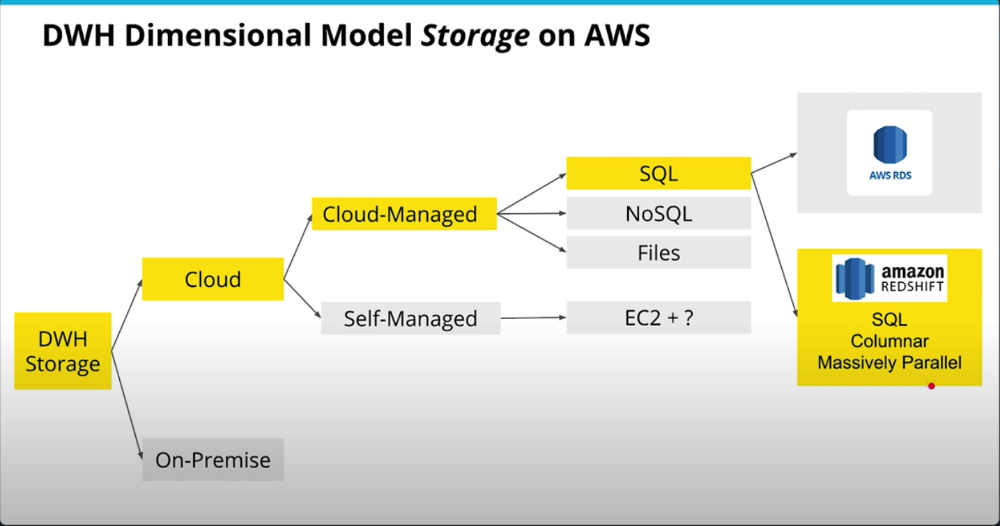
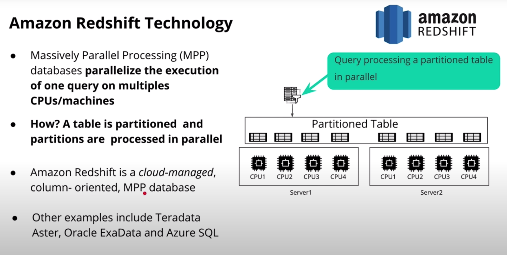
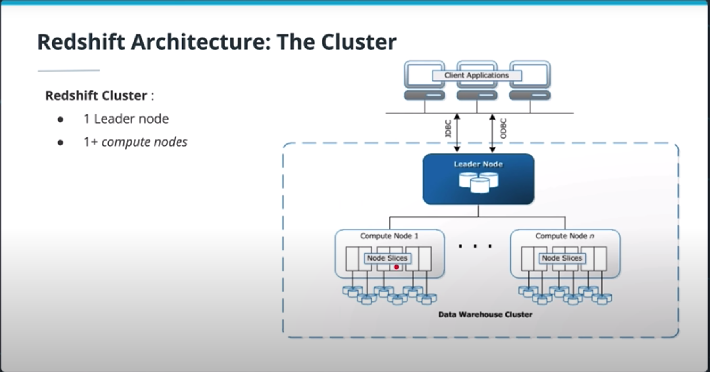
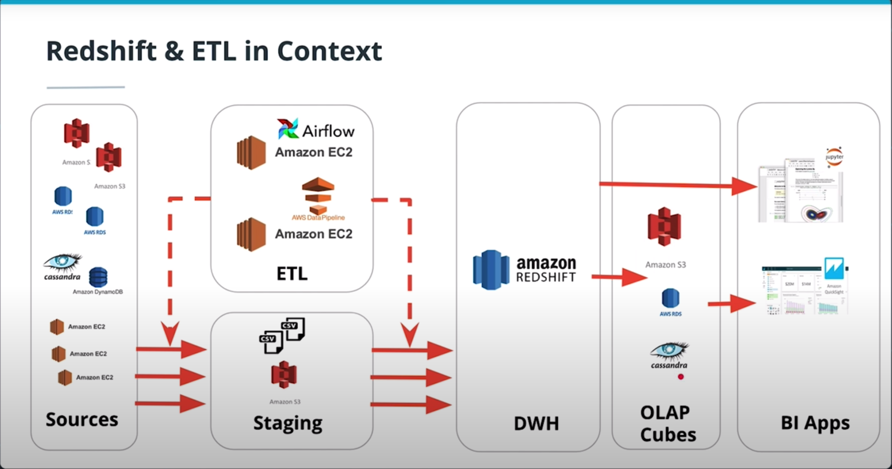
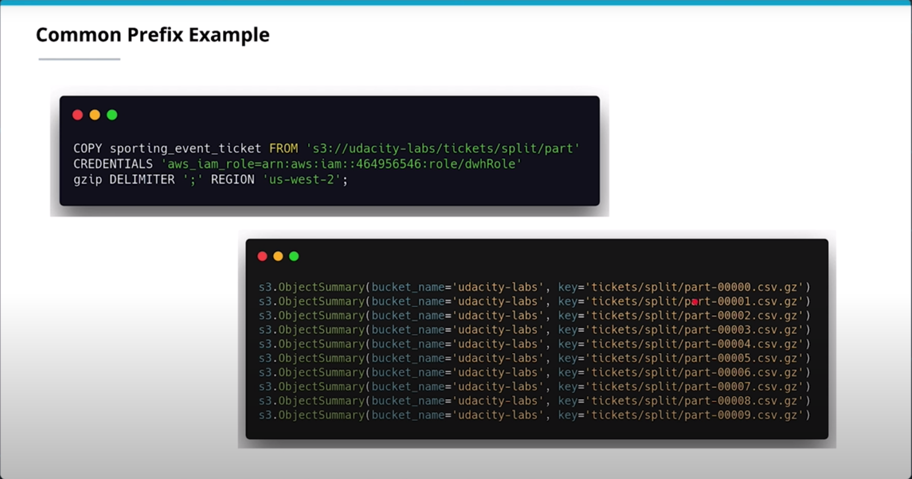
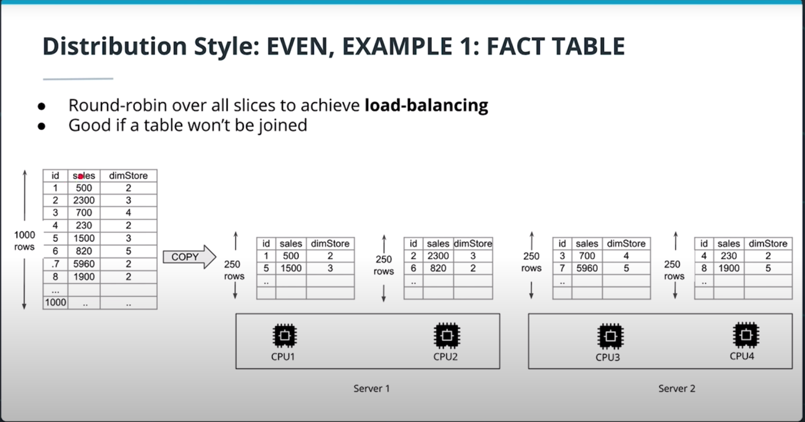
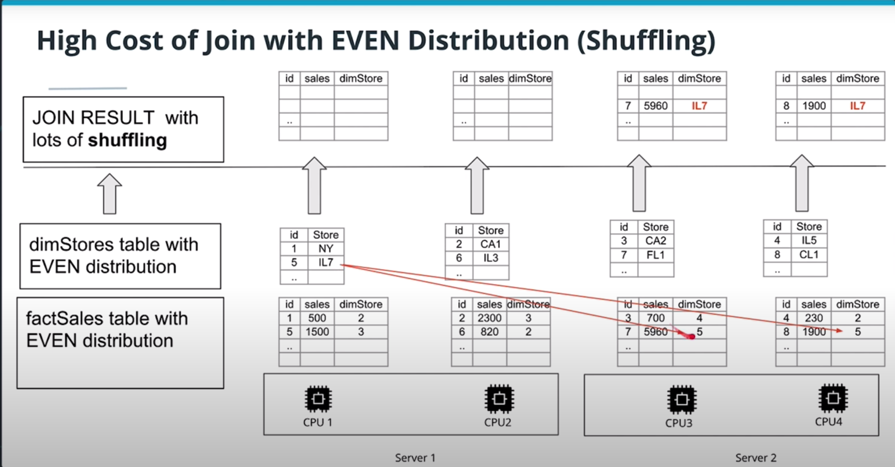
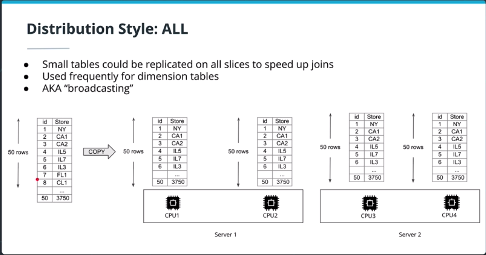
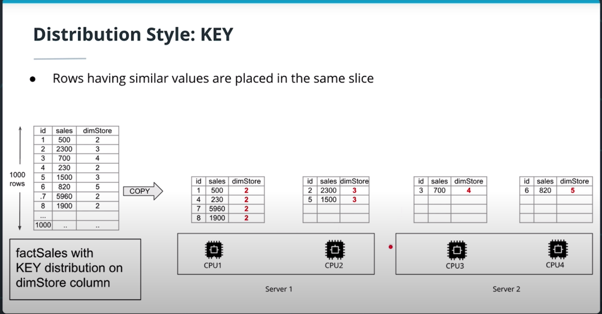
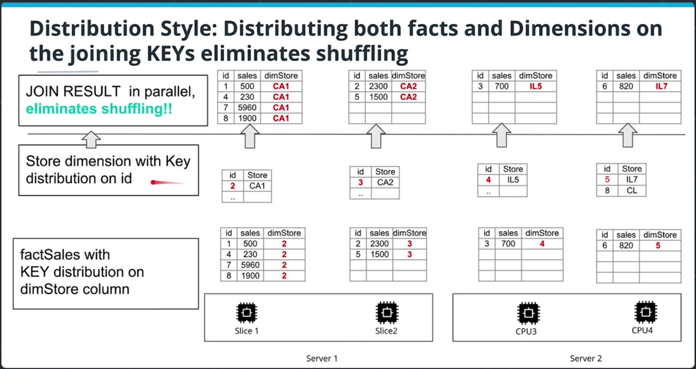

# Cloud Data Warehouses

#### Operational vs Analytical Business Process
* Operational Processes (Make it work)
* Analytical Processes (Whats going on)
* Same data source for operational & analytical processes?
    * Operational DBs are greate for operations, no redundancy and high integrity
    * However too slow for analytics, too many joins. And analytics can put a heavier load on these DBs also used for operations
* Soultion for this use case is the warehouse. 

* A Data Warehouse
    * is optimized to support processes for analysis
    * has data gathered from multipe sources
    * is an Online Analytical Processing system (OLAP)
    * **A copy of transaction data specifically structured for query and analysis**
    * **A system that retrieves and consolidates data periodically from the source systens into dimensional or normalized data store. It usually keeps years of history and is queried for business intelligence or other analytical activities. It is typically updated in batches, not every time a transaction happens in the soource system**

#### Data Warehouse Architecture
*  __Kimball Bus Architecture__
    
    * Dimensional Model
        * Should not be aggregated at all
        * At __Atomic__ level, its lowest denomination
    * Organized by Department
        * Sales/Marketing etc.
    * __Conformed Dimensions__
        * if I use a date dimension, I use it across all departments

* Independent Data Marts
    * Each Department has different ETL process
    * Totally oposite of conformed dimensions
    * Each data mart could do whatever they like/need
    * This could lead to inconsistant data though
    * But alot of flexibility
    * Not really encouraged

* __Corporate Information Factor (CIF)__
    
    * We still have independent data marts but data comes through a middle man that is the enterprise data warehouse first to ensure consistancy
    * BI tool could used data from data marts but can also go down the the atomic levels too if need be
    * Allows each datamart to do as they please with their data because the clean data exits

* __Hybrid Bus & CIF__
    

# Cloud Computing
**Using a network of remote servers hosted on the internet to store, manage and process data rather than a local server or personal computer.**

#### Amazon Redshift



* Column oriented storage
* Best suited for OLAP workloads
* Internally, its a modified postresql db
* Massively Parallel Processing (MPP) database.
* Tables are paritioned and distributed across CPUs
* Leader Node (one), coordiates the compute nodes, handles external communication and optimizes query execution
*  Compute Nodes (multiple), Each has its own CPU, memory and disk. Can scalue up to be more powerful or scale out for more nodes
* Node Slices, a slice is a CPU. A cluster with N slices can process N partitions of a table simuiltaneously. It doesnt matter if these slices are on one machine more many, we take the sum of the slices to understand how many partitions to could be processed at once
* The total number of nodes in a redshift cluster is equal to the number of AWS EC2 instances used in the cluster



* Copying from `staging` (S3) to `DWH` (Redshift). You should be use copy commands because its much faster than insert due to the parallelized bulk imports seen below.
* The `FROM` clause is actually a prefix pointing to 10 different zips



#### Implementing DWH Exersise 1
* Launching a Redshift Cluster via console
    * https://console.aws.amazon.com/redshift/
* Cluster security
    * The cluster needs access to s3 Buckets (staging bucket // see etl in context above)
        * We need to attach a role to the cluster
    * The cluster is only accessible only from the virtual private cloud (VCP). We need to access this cluster from jupyter notebook (see etl in context)
        * Give port access

```
    import boto3

	DWH_CLUSTER_TYPE = "multi-node"
	DWH_NUM_NODES = 4
	DWH_NODE_TYPE = "dc2.large"
	DWH_CLUSTER_IDENTIFIER = "dwhCluster"
	DWH_DB = "dwh"
	DWH_DB_USER = "dwhuser"
	DWH_DB_PASSWORD = "Passw0rd"
	DWH_PORT = 5439
	DWH_IAM_ROLE_NAME = "dwhRol"

    ec2 = boto3.client(
        "ec2",
        region_name="us-west-1",
        aws_access_key_id=KEY,
        aws_secret_access_key=SECRET
    )

    s3 = boto3.client(
        "s3",
        region_name="us-west-1",
        aws_access_key_id=KEY,
        aws_secret_access_key=SECRET
    )

    iam = boto3.client(
        "iam",
        region_name="us-west-1",
        aws_access_key_id=KEY,
        aws_secret_access_key=SECRET
    )

    redshift = boto3.client(
        "redshift",
        region_name="us-west-1",
        aws_access_key_id=KEY,
        aws_secret_access_key=SECRET
    )

    # STEP ONE: IAM ROLE
    assume_role_doc = json.dumps({
        "Version": "2012-10-17",
        "Statement": [
            {
                "Effect": "Allow",
                "Principal": {
                    "Service": "redshift.amazonaws.com"
                },
                "Action": "sts:AssumeRole"
            }
        ]
    })

    dwhRole = iam.create_role(
        RoleName=DWH_IAM_ROLE_NAME,
        Description="Allow redshift to read from S3 Bucket",
        AssumeRolePolicyDocument=assume_role_doc
    )

    iam.attach_role_policy(
        PolicyArn="arn:aws:iam::aws:policy/AmazonS3ReadOnlyAccess",
        RoleName=DWH_IAM_ROLE_NAME
    )

    roleArn = iam.get_role(
        RoleName=DWH_IAM_ROLE_NAME 
    )["Role"]["Arn"]

    # Copied from AWS Console
    ## https://console.aws.amazon.com/iam/home?region=us-west-1#/policies/arn:aws:iam::aws:policy/AmazonS3ReadOnlyAccess$serviceLevelSummary
    ## arn:aws:iam::aws:policy/AmazonS3ReadOnlyAccess

    # STEP TWO: REDSHIFT CLUSTER
    response = redshift.create_cluster(
        # add parameters for hardware
        DBName=DWH_DB,
        ClusterIdentifier=DWH_CLUSTER_IDENTIFIER,
        ClusterType=DWH_CLUSTER_TYPE,
        NodeType=DWH_NODE_TYPE,
        NumberOfNodes=int(DWH_NUM_NODES),
        # add parameters for identifiers & credentials
        MasterUsername=DWH_DB_USER,
        MasterUserPassword=DWH_DB_PASSWORD,
        # add parameter for role (to allow s3 access)
        IamRoles=[
        roleArn
        ]
    )

    metadata_of_interest = [
        "ClusterIdentifier",
        "NodeType",
        "ClusterStatus",
        "MasterUsername",
        "DBName",
        "Endpoint",
        "NumberOfNodes",
        "VpcId"
    ]

    describe_dict = redshift.describe_clusters(
        ClusterIdentifier=DWH_CLUSTER_IDENTIFIER
    )["Clusters"][0]

    {k: v for (k, v) in describe_dict.items() if k in metadata_of_interest}

    print("DWH_ENDPOINT: ", describe_dict["Endpoint"]["Address"])
    print("DWH_ROLE_ARN: ", describe_dict["IamRoles"][0]["IamRoleArn"])
    print("Role ARN: ", roleArn)

    DWH_ENDPOINT = describe_dict["Endpoint"]["Address"]
    DWH_ROLE_ARN = describe_dict["IamRoles"][0]["IamRoleArn"]


    # STEP 3: OPEN TCP PORT TO CLUSTER END POINT
    defaultSg = ec2.create_security_group(
        Description="Allowing BI Tools to access the Redshift DB in cluster",
        GroupName="defaultSg",
        VpcId=describe_dict["VpcId"]
        )


    # THIS DIDNT WORK // HAD TO GO TO CONSOLE
    ## https://us-west-1.console.aws.amazon.com/ec2/home?region=us-west-1#SecurityGroup:group-id=sg-2d57a950
    responseSg = ec2.authorize_security_group_ingress(
        IpProtocol="TCP",
        CidrIp="0.0.0.0/0",
        FromPort=int(DWH_PORT),
        ToPort=int(DWH_PORT),
        GroupId=defaultSg["GroupId"],
        GroupName="defaultSg"
    )
    %load_ext sql
    conn_string="postgresql://{}:{}@{}:{}/{}".format(DWH_DB_USER, DWH_DB_PASSWORD, DWH_ENDPOINT, DWH_PORT,DWH_DB)
    print(conn_string)
    # %sql $conn_string

```

#### Optimizing Table Design

* __Even__
    * Load balance, try to give each node slice (CPU) an equal amount
    * But no intelligence build into how these loads are distributed
    * Can cause issues when joining due to shuffling. Data from one cpu will want to join with data from another cpu which incurs network traffic
    * We want to limit __Shuffling__

    
    

* __All__
    * Small tables are replicated on every node to speed up joins. 
    * Generally used for dimension tables (stores/metros etc.)
    * AKA "broadcasting"

    

* __Auto__
    * Leave decision up to Redshift
    * "small" tables are distributed with ALL
    * "large" tables distributed with EVEN

* __Key__
    * Rows with similar values are placed in the same slice
    * Can lead to a skewed distribution
    * However very usefull when a dimension table is too big to be distrubuted with ALL. In that case we distribute both fact and dimension tables using the same dist key
    
    
    

* Sorting Key
    * One can define its columns as a sort key
    * Upon loading, rows are sorted before distribution to slices
    * Minimizes query time since each node already has contiguous ranges of rows based on sorting key
    * Useful for columns that are used frequently for sorting like the data dimension and it corresponding foreign key in the fact table 