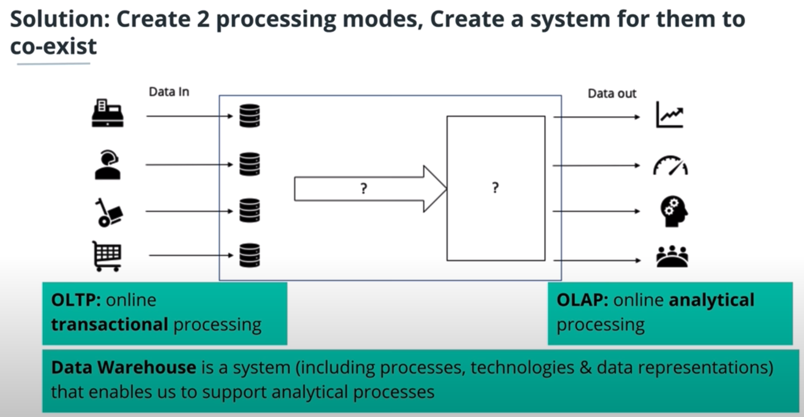
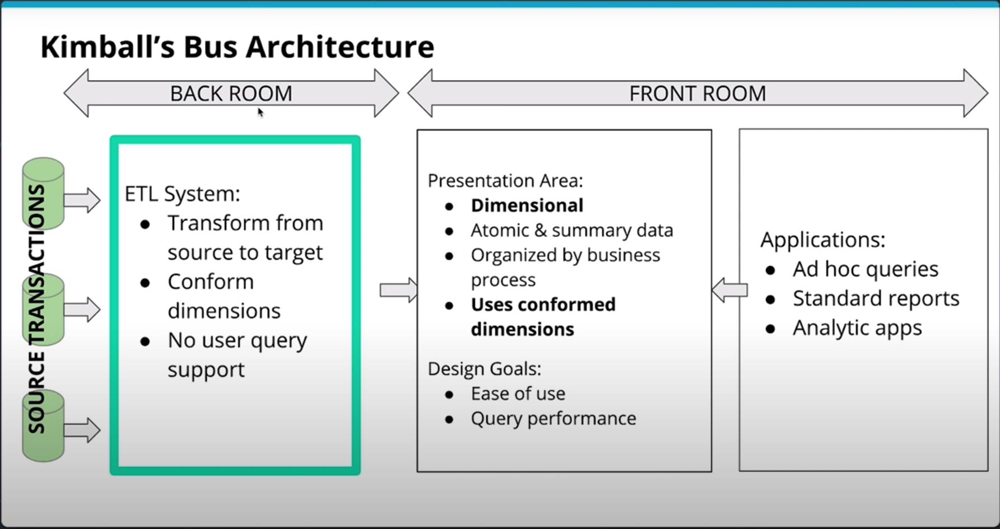
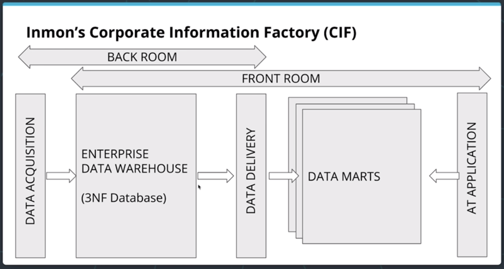
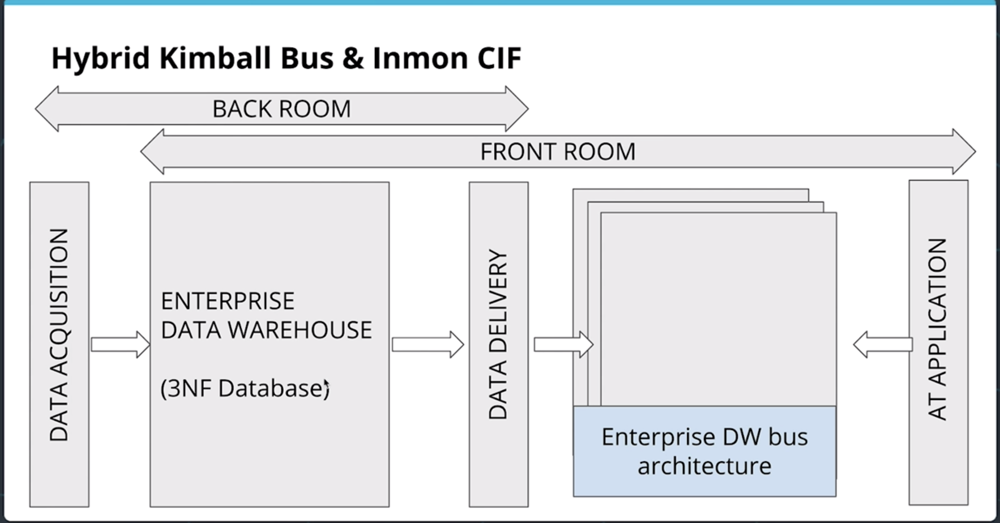

# Cloud Computing
**Using a network of remote servers hosted on the internet to store, manage and process data rather than a local server or personal computer.**

* 

# Cloud Data Warehouses

#### Operational vs Analytical Business Process
* Operational Processes (Make it work)
* Analytical Processes (Whats going on)
* Same data source for operational & analytical processes?
    * Operational DBs are greate for operations, no redundancy and high integrity
    * However too slow for analytics, too many joins. And analytics can put a heavier load on these DBs also used for operations
* Soultion for this use case is the warehouse. 

* A Data Warehouse
    * is optimized to support processes for analysis
    * has data gathered from multipe sources
    * is an Online Analytical Processing system (OLAP)
    * **A copy of transaction data specifically structured for query and analysis**
    * **A system that retrieves and consolidates data periodically from the source systens into dimensional or normalized data store. It usually keeps years of history and is queried for business intelligence or other analytical activities. It is typically updated in batches, not every time a transaction happens in the soource system**

#### Data Warehouse Architecture
*  __Kimball Bus Architecture__
    
    * Dimensional Model
        * Should not be aggregated at all
        * At __Atomic__ level, its lowest denomination
    * Organized by Department
        * Sales/Marketing etc.
    * __Conformed Dimensions__
        * if I use a date dimension, I use it across all departments

* Independent Data Marts
    * Each Department has different ETL process
    * Totally oposite of conformed dimensions
    * Each data mart could do whatever they like/need
    * This could lead to inconsistant data though
    * But alot of flexibility
    * Not really encouraged

* __Corporate Information Factor (CIF)__
    
    * We still have independent data marts but data comes through a middle man that is the enterprise data warehouse first to ensure consistancy
    * BI tool could used data from data marts but can also go down the the atomic levels too if need be
    * Allows each datamart to do as they please with their data because the clean data exits

* __Hybrid Bus & CIF__
    

