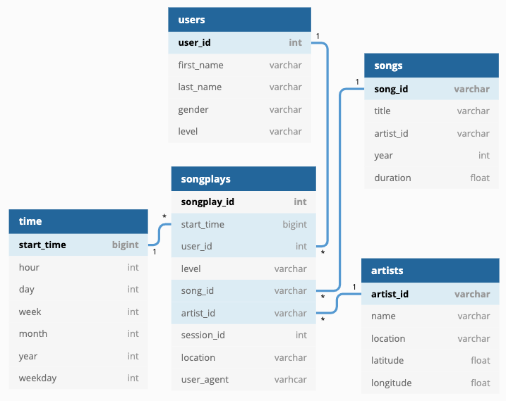

# Project 4: Data Lake

### Introduction
A music streaming startup, Sparkify, has grown their user base and song database even more and want to move their data warehouse to a data lake. Their data resides in S3, in a directory of JSON logs on user activity on the app, as well as a directory with JSON metadata on the songs in their app.

As their data engineer, you are tasked with building an ETL pipeline that extracts their data from S3, processes them using Spark, and loads the data back into S3 as a set of dimensional tables. This will allow their analytics team to continue finding insights in what songs their users are listening to.

You'll be able to test your database and ETL pipeline by running queries given to you by the analytics team from Sparkify and compare your results with their expected results.

### Project Description
In this project, you'll apply what you've learned on Spark and data lakes to build an ETL pipeline for a data lake hosted on S3. To complete the project, you will need to load data from S3, process the data into analytics tables using Spark, and load them back into S3. You'll deploy this Spark process on a cluster using AWS.

### Song Dataset

The first dataset is a subset of real data from the Million Song Dataset. Each file is in JSON format and contains metadata about a song and the artist of that song. The files are partitioned by the first three letters of each song's track ID. For example, here are filepaths to two files in this dataset.

`song_data/A/B/C/TRABCEI128F424C983.json`
`song_data/A/A/B/TRAABJL12903CDCF1A.json`

And below is an example of what a single song file,     `TRAABJL12903CDCF1A.json`, looks like.

```
{
    "num_songs": 1,
    "artist_id": "ARJIE2Y1187B994AB7", 
    "artist_latitude": null,
    "artist_longitude": null,
    "artist_location": "",
    "artist_name": "Line Renaud",
    "song_id": "SOUPIRU12A6D4FA1E1",
    "title": "Der Kleine Dompfaff",
    "duration": 152.92036,
    "year": 0
}
```

### Log Dataset

The second dataset consists of log files in JSON format generated by this event simulator based on the songs in the dataset above. These simulate activity logs from a music streaming app based on specified configurations.

The log files in the dataset you'll be working with are partitioned by year and month. For example, here are filepaths to two files in this dataset.

`log_data/2018/11/2018-11-12-events.json`
`log_data/2018/11/2018-11-13-events.json`

And below is an example of what the data in a log file, 2018-11-12-events.json, looks like..


### Schema After Processing



### Running Job/Script
**If running script locally:**
1. Set `UDACITY_KEY` and `UDACITY_SECRET` variables in environment
2. Un-comment the imports for the following libraries (glob, boto3, functools)

**Running remotely on Spark Cluster:**
1. Create cluster via EMR
    * Ensure spark is on machines
2. Setup an SSH Tunnel to the Master Node using Dynamic Port Forwarding
    * https://docs.aws.amazon.com/emr/latest/ManagementGuide/emr-ssh-tunnel.html
3. Configure Proxy Settings to View Websites Hosted on the Master Node
    * see settings in `foxyproxy-settings.xml`)
    * https://docs.aws.amazon.com/emr/latest/ManagementGuide/emr-connect-master-node-proxy.html
4. SSH to cluster
5. SCP `etl.py` and `sql/` to cluster
    * https://stackoverflow.com/questions/11388014/using-scp-to-copy-a-file-to-amazon-ec2-instance
6. Run script with `/usr/bin/spark-submit --master yarn etl.py`
    * `which spark-submit` to find