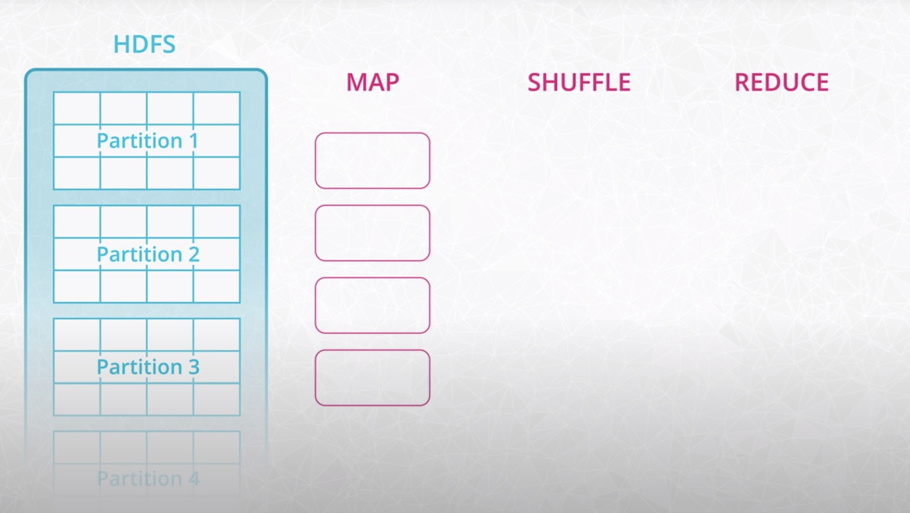
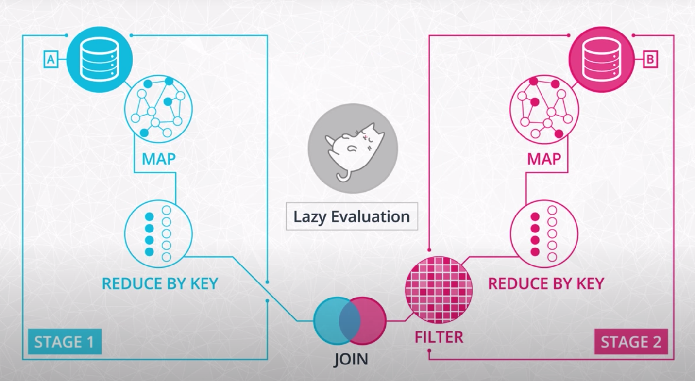
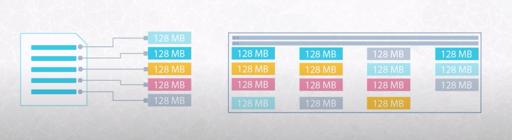

# Spark

## Why learn Spark
* Spark is currently one of the most popular tools for big data analytics. You might have heard of other tools such as Hadoop. Hadoop is a slightly older technology although still in use by some companies. Spark is generally faster than Hadoop, which is why Spark has become more popular over the last few years.

* There are many other big data tools and systems, each with its own use case. For example, there are database system like Apache Cassandra and SQL query engines like Presto. But Spark is still one of the most popular tools for analyzing large data sets.

## Four Machine Components
__CPU (Central Processing Unit)__
* The CPU is the "brain" of the computer. Every process on your computer is eventually handled by your CPU. This includes calculations and also instructions for the other components of the compute.
* The CPU can also store small amounts of data inside itself in what are called registers. These registers hold data that the CPU is working with at the moment.
* The registers make computations more efficient: the registers avoid having to send data unnecessarily back and forth between memory (RAM) and the CPU.

__Memory (RAM)__
* When your program runs, data gets temporarily stored in memory before getting sent to the CPU. Memory is ephemeral storage - when your computer shuts down, the data in the memory is lost.

__Storage (SSD or Magnetic Disk)__
* Storage is used for keeping data over long periods of time. When a program runs, the CPU will direct the memory to temporarily load data from long-term storage.

__Network (LAN or the Internet)__
* Network is the gateway for anything that you need that isn't stored on your computer. The network could connect to other computers in the same room (a Local Area Network) or to a computer on the other side of the world, connected over the internet.

## The Hadoop Ecosystem

__Hadoop__ 
* An ecosystem of tools for big data storage and data analysis. Hadoop is an older system than Spark but is still used by many companies. The major difference between Spark and Hadoop is how they use memory. Hadoop writes intermediate results to disk whereas Spark tries to keep data in memory whenever possible. This makes Spark faster for many use cases.

__Hadoop MapReduce__ 


* __Don't get confused by the terminology! MapReduce is a programming technique. Hadoop MapReduce is a specific implementation of the programming technique.__
* Oftentimes when someone is talking about Hadoop in general terms, they are actually talking about Hadoop MapReduce. However, Hadoop is more than just MapReduce
* System for processing and analyzing large data sets in parallel.
* MapReduce is a programming technique for manipulating large data sets. "Hadoop MapReduce" is a specific implementation of this programming technique.
* The technique works by first dividing up a large dataset and distributing the data across a cluster. In the map step, each data is analyzed and converted into a (key, value) pair. Then these key-value pairs are shuffled across the cluster so that all keys are on the same machine. In the reduce step, the values with the same keys are combined together.

__Hadoop YARN__ 
* Resource manager that schedules jobs across a cluster. The manager keeps track of what computer resources are available and then assigns those resources to specific tasks.

__Hadoop Distributed File System (HDFS)__
* Big data storage system that splits data into chunks and stores the chunks across a cluster of computers.

As Hadoop matured, other tools were developed to make Hadoop easier to work with. These tools included:

__Apache Pig__ 
* SQL-like language that runs on top of Hadoop MapReduce

__Apache Hive__
* another SQL-like interface that runs on top of Hadoop MapReduce

### How Spark Relates to Hadoop
* Spark, which is the main focus of this course, is another big data framework. Spark contains libraries for data analysis, machine learning, graph analysis, and streaming live data. Spark is generally faster than Hadoop. This is because Hadoop writes intermediate results to disk whereas Spark tries to keep intermediate results in memory whenever possible.

* The Hadoop ecosystem includes a distributed file storage system called HDFS (Hadoop Distributed File System). Spark, on the other hand, does not include a file storage system. You can use Spark on top of HDFS but you do not have to. Spark can read in data from other sources as well such as Amazon S3.

## Data Wrangling with Spark!

### Pure Functions
* A pure function is side-effect free, plus the result does not depend on anything other than its inputs. For a given input, the only effect of a pure function is the output it produces—there are no other effects

### DAG (Directed Acyclical Graph)
* Every spark function makes copies of its input data and never changes the original parent data
* Because spark doesnt change or mutate the input data its called __immutible__
* What happens if you have alot of functions? You chain together the functions that all acomplish one task. A main function composed of multiple sub function. If the main function is going to be pure so do all the subfunctions
* If spark needs to make a copy of the input data for each sub function you'll run out of memory real fast
* This is where __lazy evaluation__ comes into play. Before spark does anything with the data in your program it creates step by step instructions of what data it will need AKA __DAG__
* The DAG helps spark procrastinate, waiting for the very last moment to get the data it needs. 


### Distributed Data Stores
* Hadoop Distributed File System (HDFS) split files into 128MB chunks and distributes them across the cluster
* Data stored in a fault tolorant way so if a machine breaks or becomes unavailable we dont lose the data

* If we dont want to maintain our own cluster many people use S3

### Spark Session
```
# SparkContext is the main entry point for spark functionality and connects your application to the cluster
# If you want lower level abstractions we will create objects with SparkContext
# SparkConf lets us specify details about the applications

from pyspark import SparkContext, SparkConf
configure = SparkConf().setAppName("name").setMaster("local")
sc = SparkContext(conf = configure)

# To read dataframes we will need SparkSession
# getOrCreate is like "CREATE SESSION IF NOT EXISTS"

from pyspark.sql import SparkSession
spark = SparkSession \
    .bulider \
    .appName("app name") \
    .config("config option", "config value") \
    .getOrCreate()
```

### Reading and Writing Data
```
# Reading in a local JSON
path = "data/sparkify_log_small.json"
user_log = spark.read.json(path)

# view columns
user_log.printSchema()

# describe the df
user_log.describe().show()

# first row then first 5 rows (head)
user_log.show(n=1)
user_log.take(5)

# Show columns data
user_log.select("userID").show()

# Export
out_path = "data/sparkify_log_small.csv"
user_log.write.save(out_path, format="csv", header=True)
```

### Data Wrangling with DataFrames
```
user_log.select("page").dropDuplicates().sort("page").show()

user_log.select(["userId", "firstname", "page", "song"]) \
    .where(user_log.userId == "1046") \
    .collect()

# user defined functions
from pyspark.sql.functions import udf
get_hour = udf(lambda x: datetime.datetime.formtimestamp(x / 1000.0). hour)
user_log = user_log.withColumn("hour", get_hour(user_log.ts))

# Count by hour
hour_count = user_log.filter(user_log.page == "NextSong")\
    .groupby(user_log.hour).count()\
    .orderBy(user_log.hour.cast("float"))

hour_count.show()

# to pandas dataframe
hour_count_pd = hour_count.toPandas()

# drop nulls
user_log.dropna(
    how="any",
    subset = ["userId", "sessionId"]
)

# Window functions
from pyspark.sql.types import IntegerType
from pyspark.sql import Window
from pyspakr.sql.functions import sum as Fsum

flag_downgrade_event = udf(lambda x: 1 if x == "Submit Downgrade" else 0, IntegerType())
user_log = user_log.withColumn("downgraded", flag_downgrade_event("page"))
windowval = Window.partitionBy("userId").orderBy(desc("ts")).rangeBetween(Window.unboundedPreceding, 0)
user_log = user_log.withColumn("phase", Fsum("downgraded").over(windowval))
```

#### Using Declarative Programming Aproach (SQL)
```
# Effectively creates temporary sql table of the dataframe
# When you terminate session this view is gone
user_log.createOrReplaceTempView("user_log_table")
spark.sql("SELECT * FROM user_log_table LIMIT 2").show()

get_hour = udf(lambda x: datetime.datetime.formtimestamp(x / 1000.0). hour)
hours = spark.sql(
    """
    SELECT get_hour(ts) AS hour
    FROM user_log_table
    """
).show()

print(hours.toPandas())
```

## Setting up Spark clusters with AWS

#### Overview of setup
1. S3 will store the dataset
2. We rent a cluster of machines. Spark Cluster running on EC2 (Elastic Compute Cloud)
3. Log in from local computer to this spark cluster
4. Upon running our spark code, the cluster will load data from S3 into the clusters memory distributed across the nodes

#### Spark Cluster Managers
* Spark provides 3 options for working on a cluster
    * Standalone Mode: For an individual like localmode but the data is now distributed
    * MESOS & YARN: For sharing a spark cluster across a team of engineers and analysts

#### Setup
1. Create keypair to SSH to the cluster securily 
    * https://us-west-2.console.aws.amazon.com/ec2/v2/home?region=us-west-2#KeyPairs:
    * This will download a pim file, this is one half of the key pair. the other half will be in the cluster
    * pem file is in downloads folder
2.  Navigate to the EMR service (Elastic Map Reduce) to create cluster
    * https://us-west-2.console.aws.amazon.com/elasticmapreduce/home?region=us-west-2
    * Since a Spark cluster includes multiple machines, in order to use Spark code on each machine, we would need to download and install Spark and its dependencies. This is a manual process. Elastic Map Reduce is a service offered by AWS that negates the need for you, the user, to go through the manual process of installing Spark and its dependencies for each machine.
3. General Config
    * cluster_name: spark-udacity
    * launch_mode: "cluster". If you select "step execution", the cluster will be shutdown after the spark job completes. This is cost effective but not for debugging or learning
4. Software Config
    * release: emr-5.20.0
    * applications: Spark: Spark 2.4.0 on Hadoop 2.8.5 YARN with Ganglia 3.7.2 and Zeppelin 0.8.0
        * Ganglia is for monitoring and zeppelin is for scala notebooks. we wont be using either of these 2 applications
5. Hardware Config
    * instance_type: m5.xlarge
        * "M" family used for multipurpose clusters
        * "C" optimized CPU
        * "R" optimized for RAM
        * 5 stands for fifth generation of hardware from AWS
        * XL for the size/quantity of CPU, Memory, Storage, Network Performance
6. Security and Access
    * EC2 Key Pair: select the keypair created earlier (spark-cluster)

#### Additional Notes
* Once EMR is up it will have a "waiting" status
* Go to security group of the master node and add inbound rules for your IP address
    * **Add inbound rule for SSH from (My IP) current IP // Port 22**
* Lock down your PEM File
    * **chmod 400 spark-cluster.pem // Key is too open**
* SSH to cluster
    * SSH with tunneling // **ssh -i spark-cluster.pem -ND 8157 hadoop@ec2-54-219-179-137.us-west-1.compute.amazonaws.com**
    * port 8157 is specified, can choose whatever
* FoxyProxy // see settings in `foxyproxy-settings.xml`
    * Put setting on to use proxy for ALL URLS
* SSH to master node // "ssh -i spark-cluster.pem ec2-user@ec2-54-219-179-137.us-west-1.compute.amazonaws.com"

#### AWS CLI
* "--profile udacity" required for every command as Shipt is my default account
    * `aws configure list --profile udacity`
* `aws emr list-clusters --region us-west-1 --active --profile udacity`
* be sure to specify the proper region

### **Submitting Spark Scripts**
* `which spark-submit`
    * /usr/bin/spark-submit
```
/usr/bin/spark-submit --master yarn lower_songs.py
```
* to import pyspark (not sure why this isnt explained either)
    * https://stackoverflow.com/questions/31976353/amazon-emr-pyspark-module-not-found
*  Spark history server will contain information about the job submitted
* `sparkContext.setLogLevel("ERROR")` to get only error level logs

### **Reading and writing to S3**
```
spark = SparkSession.builder.appName("LowerSongTitles").getOrCreate()
df = spark.read.csv(“s3://my_bucket/path/to/file/file.csv”)

## OR

df = spark.read.format('csv').options(header='true').load("s3://adeniyi-harrison-test/cpg_brands_1583885440.7418706.csv")
```

### **Transferring local files to cluster**
```
scp -i ~/.ssh/spark-cluster.pem febuary_nestle_upc_level.csv hadoop@ec2-13-52-103-121.us-west-1.compute.amazonaws.com:~/
```
* https://stackoverflow.com/questions/11388014/using-scp-to-copy-a-file-to-amazon-ec2-instance

### Accumulators
As the name hints, accumulators are variables that accumulate. Because Spark runs in distributed mode, the workers are running in parallel, but asynchronously. For example, worker 1 will not be able to know how far worker 2 and worker 3 are done with their tasks. With the same analogy, the variables that are local to workers are not going to be shared to another worker unless you accumulate them. Accumulators are used for mostly sum operations, like in Hadoop MapReduce, but you can implement it to do otherwise

```
incorrect_records = SparkContext.accumulator(0,0)

incorrect_records.value
# returns 0

def_add_incorrect_record():
    global incorrect_records
    incorrect_records += 1

from pyspark.sql function udf
correct_ts = udf(lambda x: 1 if x.isdigit() else add_incorrect_record())

df = df.withColumn("ts_isdigit", correct_ts(df.ts))
df.collect()

print(incorrect_records.value)
# returns 4
```

## Random Notes from Project
```
spark.sparkContext
spark.sparkContext.getConf().getAll()
# print information about spark object such as it being local and the app name if set

# To change to Java 8 because everything above is not compatible
* https://stackoverflow.com/questions/21964709/how-to-set-or-change-the-default-java-jdk-version-on-os-x

# schema = StructType([StructField("num_songs", IntegerType(), True), StructField("artist_id", StringType(), True), StructField("artist_latitude", StringType(), True), StructField("artist_longitude", StringType(), True), StructField("artist_location", StringType(), True), StructField("artist_name", StringType(), True), StructField("song_id", StringType(), True), StructField("title", StringType(), True), StructField("duration", IntegerType(), True), StructField("year", IntegerType(), True)])
# schema wasnt needed
# log_data = spark.read.json("s3a://adeniyi-data-lake-project/input-data/log-data/*.json", schema)
# song_data = spark.read.json("s3n://adeniyi-data-lake-project/input-data/song-data/song_data/*/*/*/*.json")

* copy from local to emr cluster
* scp -i ~/.ssh/spark-cluster.pem etl.py hadoop@ec2-54-219-172-221.us-west-1.compute.amazonaws.com:~/
    * Just the etl.py file
* scp -i ~/.ssh/spark-cluster.pem -r sql/ hadoop@ec2-54-219-172-221.us-west-1.compute.amazonaws.com:~/
    * copy folder


```