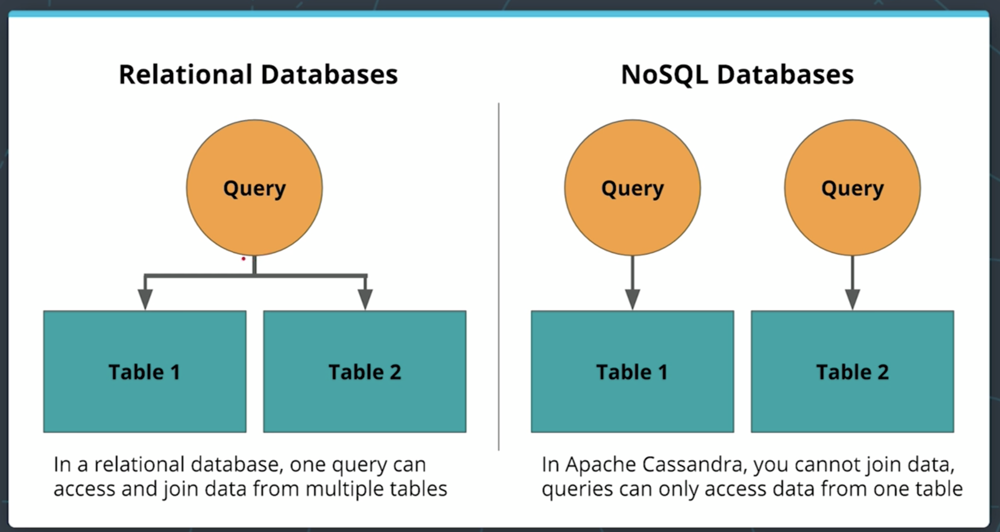

# NOSQL Data Modeling

* When to use a NOSQL DB
    * Need high availability
    * Have large amounts of data
    * Need linear scalability
    * Low latency // Fast reads and writes

### Distributed Databases
* Database scaled horizontally, made up of multiple machines
* In order to have the high availability you need to have copies of your data
* **Eventual Consistancy**
    * A consistancy model in distributed computing to achive high availability that informally guarantees that if no new updates are made to a given item, eventually all accesses to that item will return the last updated item
    * Eventually each copy of my data will be the same
    * If there are new changes, there will be some inconsisancies (milliseconds hopefully)

* **CAP Theorem**
    * Theorem in computer science that states a distributed system cannot simultaneously guarantee more than 2 of the 3 statements
    * **Consistency:** Every read from the database gets the latest (and correct) piece of data or an error
    * **Availability:** Every request is received and a response is given -- without a guarantee that the data is the latest update
    * **Partition Tolerance:** The system continues to work regardless of losing network connectivity between nodes
    * As the CAP Theorem Wikipedia entry says, "The CAP theorem implies that in the presence of a network partition, one has to choose between consistency and availability." So there is no such thing as Consistency and Availability in a distributed database since it must always tolerate network issues. You can only have Consistency and Partition Tolerance (CP) or Availability and Partition Tolerance (AP). Remember, relational and non-relational databases do different things, and that's why most companies have both types of database systems.
    * **Apache Cassandra supports Availability and Partition Tolerance**
    * If Apache Cassandra is not built for consistency, won't the analytics pipeline break?
        * If I am trying to do analysis, such as determining a trend over time, e.g., how many friends does John have on Twitter, and if you have one less person counted because of "eventual consistency" (the data may not be up-to-date in all locations), that's OK. In theory, that can be an issue but only if you are not constantly updating. If the pipeline pulls data from one node and it has not been updated, then you won't get it. Remember, in Apache Cassandra it is about Eventual Consistency.

* **Data Modeling**

    

    * Denormalization is not just okay -- it's a must
    * Denormalization must be done for fast reads
    * Apache Cassandra has been optimized for fast writes
    * ALWAYS think Queries first
    * One table per query is a great strategy
    * Apache Cassandra does not allow for JOINs between tables
    * **In CQL we cannot JOIN, GROUP BY or use subqueries**

* **Notes from Demo One**
    * Key space = Database
    * Replication_factor = How many times is your data copied
    ```
        CREATE KEYSPACE IF NOT EXISTS udacity
        WITH REPLICATION = {
            ‘class’: ‘SimpleStrategy’,
            ‘replication_factor’: 1
        }
    ```
    * Setting the `PRIMARY KEY`
        * A Simple PRIMARY KEY is just one column that is also the PARTITION KEY. A Composite PRIMARY KEY is made up of more than one column and will assist in creating a unique value and in your retrieval queries
        * The PRIMARY KEY is made up of either just the PARTITION KEY or may also include additional CLUSTERING COLUMNS
        * The PARTITION KEY will determine the distribution of data across the system
        * You want you distribution to be even along this primary key. If state is a primary key this maybe uneven due to more people living in CA than OR

* **Notes from Demo Two**
    * Clustering Columns
        * The clustering column will sort the data in sorted ascending order, e.g., alphabetical order.
        * More than one clustering column can be added (or none!)
        * From there the clustering columns will sort in order of how they were added to the primary key

* **Demo Three**
    * Where Clause
        * Data Modeling in Apache Cassandra is query focused, and that focus needs to be on the WHERE clause
        * Failure to include a WHERE clause will result in an error
        * If my PRIMARY KEY (year, artist_name, album_name) I cannot query like `SELECT * FROM test WHERE location = 'SF'`
        * This is because I need to use my partition and clustering columns first and location afterwards
    